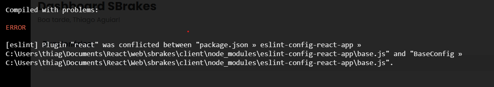

# Importante

- Ao clonar a aplicação web, no terminal, navegar até a pasta "client" e usar o comando "npm install" para baixar todas as dependências do projeto

- Após isso, use "npm start" na pasta "client" para rodar a aplicação e "npm run dev" na pasta "server" para iniciar a conexão com o banco de dados

- Ao abrir o projeto e aparecer esse erro:
  

1. Procurar o arquivo Package.JSON e dar um CRTL + S no arquivo. Assim, o erro irá desaparecer
   Motivo do erro: após várias pesquisas, não consegui encontrar o motivo, mas isso sempre acontece quando puxo um arquivo do github.

# API'S (INFORMAÇÕES IMPORTANTES)

1. API E-mail (EmailJS)
- Email que envia a senha: noreplysbrakes@gmail.com 
- Senha: SBRAKES2022@

2. API ChatBot
- DialogFlow: responsável por todo o treinamento das frases e das respostas
- Kommunicate: traz mais funcionalidades e estilos ao chatbot
  `Treinamento do Kommunicate está sendo realizado na conta de noreplysbrakes@gmail.com`